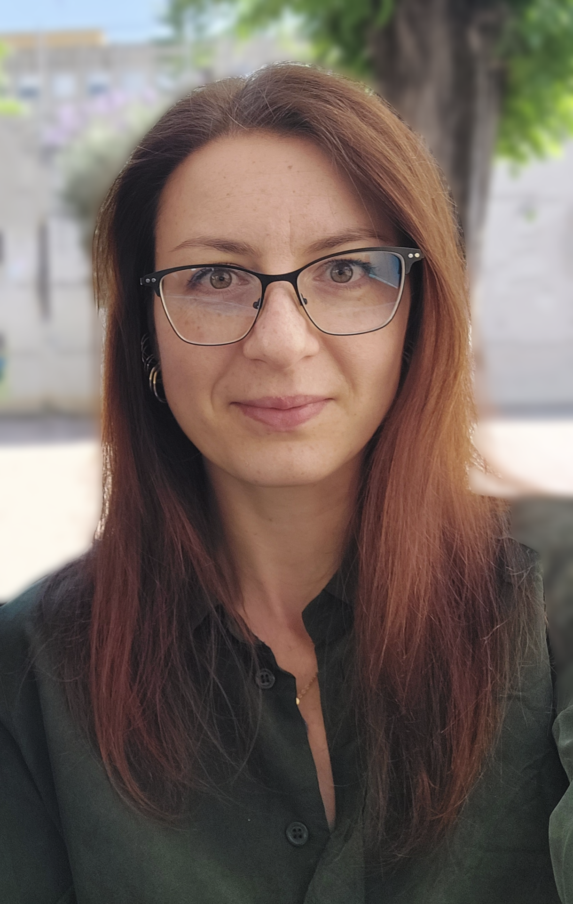

<nav style="background-color: #f4f4f4; padding: 10px; border-radius: 8px; box-shadow: 0 4px 6px rgba(0, 0, 0, 0.1);">
  <ul style="list-style: none; display: flex; justify-content: center; gap: 15px; padding: 0; margin: 0;">
    <li style="flex: 1; text-align: center;">
      <a href="{{ site.baseurl }}/" 
         style="text-decoration: none; color: #1e90ff; font-family: 'Arial', sans-serif; font-size: 1.1em; padding: 10px 20px; display: inline-block; border-radius: 6px; transition: background-color 0.3s;">
         Home
      </a>
    </li>
    <li style="flex: 1; text-align: center;">
      <a href="{{ site.baseurl }}/news/" 
         style="text-decoration: none; color: #1e90ff; font-family: 'Arial', sans-serif; font-size: 1.1em; padding: 10px 20px; display: inline-block; border-radius: 6px; transition: background-color 0.3s;">
         News
      </a>
    </li>
    <li style="flex: 1; text-align: center;">
      <a href="{{ site.baseurl }}/group/" 
         style="text-decoration: none; color: #1e90ff; font-family: 'Arial', sans-serif; font-size: 1.1em; padding: 10px 20px; display: inline-block; border-radius: 6px; transition: background-color 0.3s;">
         Group
      </a>
    </li>
    <li style="flex: 1; text-align: center;">
      <a href="{{ site.baseurl }}/research/" 
         style="text-decoration: none; color: #1e90ff; font-family: 'Arial', sans-serif; font-size: 1.1em; padding: 10px 20px; display: inline-block; border-radius: 6px; transition: background-color 0.3s;">
         Research
      </a>
    </li>
    <li style="flex: 1; text-align: center;">
      <a href="{{ site.baseurl }}/Students' projects/" 
         style="text-decoration: none; color: #1e90ff; font-family: 'Arial', sans-serif; font-size: 1.1em; padding: 10px 20px; display: inline-block; border-radius: 6px; transition: background-color 0.3s;">
         Students' Projects
      </a>
    </li>
    <li style="flex: 1; text-align: center;">
      <a href="{{ site.baseurl }}/women-in-science/" 
         style="text-decoration: none; color: #1e90ff; font-family: 'Arial', sans-serif; font-size: 1.1em; padding: 10px 20px; display: inline-block; border-radius: 6px; transition: background-color 0.3s;">
         Women in Science
      </a>
    </li>
    <li style="flex: 1; text-align: center;">
      <a href="{{ site.baseurl }}/books-for-children/" 
         style="text-decoration: none; color: #1e90ff; font-family: 'Arial', sans-serif; font-size: 1.1em; padding: 10px 20px; display: inline-block; border-radius: 6px; transition: background-color 0.3s;">
         Books for Children
      </a>
    </li>
    <li style="flex: 1; text-align: center;">
      <a href="{{ site.baseurl }}/positions/" 
         style="text-decoration: none; color: #1e90ff; font-family: 'Arial', sans-serif; font-size: 1.1em; padding: 10px 20px; display: inline-block; border-radius: 6px; transition: background-color 0.3s;">
         Positions
      </a>
    </li>
  </ul>
</nav>

  <!-- Left Column: Your photo -->
  

    
  

  <!-- Right Column: Description -->
  

    <h2 style="text-align: center; font-family: 'Arial', sans-serif; font-size: 2em; margin-bottom: 20px;">Homepage of Dr. Aneta Wojnar (/aˈnɛ.ta ˈvɔj.nar/)</h2>

    

      I am a <strong>Professor Assistant</strong> at the University of Wrocław and a <strong>Research Fellow</strong> at Complutense University of Madrid. My research primarily focuses on <em>gravity</em> and <em>thermodynamics of gravitational systems</em>.
    

    

      Previously, I held a research position at the University of Tartu, Estonia, and a postdoctoral position at the Federal University of Espirito Santo, Brazil, and Marie Curie-Skłodowska University in Lublin, Poland. I completed my PhD at the University of Wrocław, Poland, in collaboration with the University of Napoli "Federico II" in Italy.
    

    

      In addition to my academic roles, I also collaborate with <a href="https://astroteq.ai/" target="_blank" style="color: #1e90ff; text-decoration: none; font-weight: bold;">ASTROTECTONIC sp. z o.o.</a>, where I contribute to cutting-edge projects related to <em>earthquake forecasting</em> and <em>research</em>.
    

    

      Furthermore, I am passionate about science communication and serve as a science popularizer. I also write <em>children's books about physics</em>, aiming to inspire young minds with the wonders of science. You can learn more about my books on the <a href="{{ site.baseurl }}/books-for-children/" style="color: #1e90ff; text-decoration: none; font-weight: bold;">Books for Children</a> page.
    

    

      My <a href="https://inspirehep.net/authors/1421102?ui-citation-summary=true" target="_blank" style="color: #1e90ff; text-decoration: none; font-weight: bold;">updated list of publications</a> can be found on Inspire.
    

  

